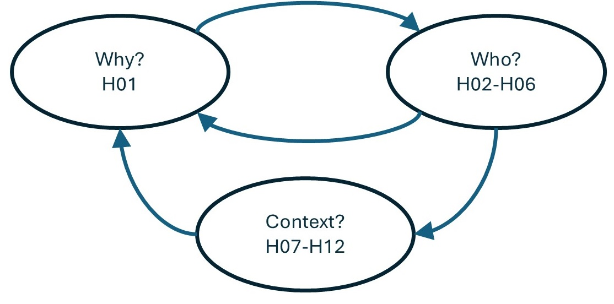

# About Navigating idea-t

This folder contains information to help you navigate idea-t and the heuristics.  At the heart of idea-t are the 12 heuristic questions; the rest of idea-t includes guidelines to help you use the heuristics.

This folder and document includes:

- [Quick Start Guide](QuickStart.md) (briefly introduced below)
- [Introducing the heuristics into your organisation](introducing-the-heuristics.md) (briefly introduced below)
- [Notes on tailoring idea-t and the heuristics to fit your organisation](tailoring-idea-t-md) (briefly introduced below)
- [Generic routes through the heuristics](genericroutes.md)
- Considerations if you are working in an organization that has a high level of understanding and maturity in its UX practices (discussed below);
- Some differences in usage depending on organization size and location of team members (discussed below);
- Some unexpected uses for the heuristics that our case study particpants mentioned! (discussed below).
  
There are also routes through idea-t for different purposes
- How to navigate the heuristics if you are [designing or building a tool or automation](tool-designer.md) including notes for tool vendors, teams building an open-source test tool, in-house teams building a test tool or automation suites, or if you are maintaining or making changes to a tool. You may find you need a subset, but that is very context-dependent;
- Navigating the heuristics if you are [evaluating, choosing, acquiring, or implementing a tool, or setting a tooling strategy](choosingtool.md)
- Almost certainly, you will need to iterate around the heuristics (click below for a flowchart that illustrates this.

Iterative Flow around the Heuristics

Generally, you would start with answering the question "Why do we need this tool?" then move on to consider the group of "Who?" questions, and finally look at the Context questions. However, information you find out from the "Who?" and "Context?" questions mean you may need to revisit "Why?", because different stakeholders you identify may have different goals in different contexts. You need to iterate between "Why?" and "Who?". The flowchart summarises this.

  

We recommend you re-use the heuristics at intervals, perhaps have a quick discussion at regular intervals to decide if you need a deep dive into any of them. 

Quick start

You might want to adopt them as an agenda for a planning meeting, or as a checklist to aid fast insights, to help you decide which heuristics you want to use for a deep dive. Timebox that activity. Materials in the [Downloads folder](../../Downloads/About-Downloads-Folder.md) and the [QuickStart](QuickStart.md) will help you.

You might want to time box how long you spend on each theme, explore them, and then decide whether to allow more time to work more deeply on discovery activities. One person who [used a cut-down version of the heuristics as a simple checklist for part of a workshop](https://huddle.eurostarsoftwaretesting.com/ladybug-open-source-project-kick-off/) said *"They just help you talk about things."* You can keep it as simple as that!

Introducing idea-t and the heuristics 
 
[Introducing the heuristics into an organisation](introducing-the-heuristics.md) may require a little planning; you need to build trust through experimenting with them.

You might find the best way to introduce them is to use the heuristics as a meeting agenda when discussing a tool or automation suite, or by using a workshop to start - materials for these are in the [Downloads folder](../../Downloads/About-Downloads-Folder.md)

 
Maturity

### UX Maturity and the Heuristics

We found in the Case Studies that if an organization is mature in its approach to UX that some of the heuristics are embedded in how people think about the design of tools. In this case you might find it useful to concentrate on the ``else'' variants of the subquestions to challenge preconceptions: Why else? Who else? Where else? and so on. Additionally you will find you can quickly assess which of the heuristics will add most value to your discussion, and then deep dive into those. 

 
Organization Size

  
### Organization Size, Team Location, and the Heuristics

We found in the Case Studies that if an organization is small and co-located so that person to person communication is easy that the heuristics can be used very informally, perhaps with a checklist on the wall.
In larger organizations, or where multiple organizations are involved, or with geographical separation of team members, communications may need to be controlled more formally. Using the heuristics as an agenda for a meeting may be a useful starting point.

Other uses

  
### Other uses for the heuristics

Some of our case study participants discussed using the heuristics to manage discussions about tools in use or changes to tools and automation suites. The examples include:

- using the heuristics during on-boarding team members to help them understand design decisions made for automation suites and tools;
- using the heuristics during discussions with stakeholders such as customers to ensure that the requirements for the tool were clear both for the customers and for the end users of the tool;
- using the heuristics to plan a pre-sales meeting about tooling requirements, using just **H01 Why?**, **H02 Who?**, **H08 Workflows** and **H10 Autonomy**

  One participant said ``it is a way to guide the discussion and open up the discussion''

  

[Back to Top](#TopofPage)

