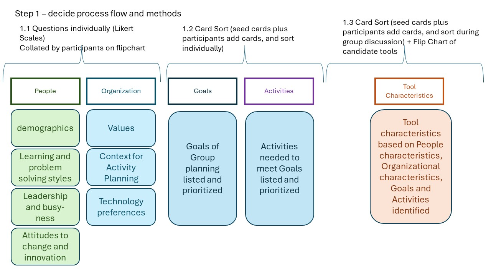
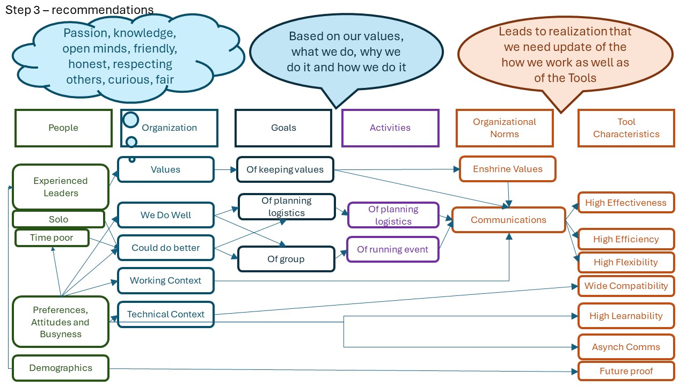

# Choosing a tool or setting a strategy

This has two sections:
- evaluating or choosing a test tool
- setting a tooling strategy
  
## Evaluating or choosing a test tool

 
Evaluating or choosing a tool

  
You could be evaluating the tool for your own use, for your team, or for the whole organization

We found during the research that people *buying* tools often forget to ask *Why* they needed the tool, and people *building* tools often forget to ask *Who for?*

Start with the *Why?* question H01.

If you are only evaluating the tool for yourself, use the questions to help you think about whether there are topics where you need to dig deeper. You may want the evaluation process to be quite quick - just good enough.

If you are evaluating for a team, especially if you are the tool purchaser but are not going to use the tool yourself, take time to think about the *Who?* and *Context?* heuristic questions, and consider that they may have different answers to H01 *``Why?''*. 
People commissioning tools need to consider the personas who will be using the tool, and the quality in use attributes that are important to those personas; having appropriate quality in use means the tool will support the people to improve their effectiveness and efficiency as testers. We found during the research examples of testing tools that reduced efficiency and effectiveness through poor quality in use, and a misunderstanding of who would be using the tool.

You will probably cover the questions in the generic order. You might not do the activities yourself, but you may want to find out if your tool supplier has those UX activities in place. 

When thinking about the goal for the tool, it is worth considering financial goals. In one case study during development of the heuristics, the participants discussed whether the licence costs for the tool were in conflict with their financial goal of cost saving. They ran an initial meeting for 30 minutes using the heuristics to consider ``shall we evaluate this tool at all?''  Heuristics H01 and H02 can be used in this way to arrive at a shortlist of tools. 

Mini usage case

Here is an example of a small group of testers using the heuristics as a frame for choosing a new tool to use for organizing an event. 
There are three diagrams, produced during the study, showing the build-up of information from planning, through collecting data, to analysing that and deciding on important characteristics for the tool.

**Diagram 1** There were about 12 people in the group, and they work together occasionally to organize and run a meet up to discuss testing. 
First, we focused on planning: we wanted to understand learning and problem solving styles (H05, H06), attitudes to change (H09), and level of busy-ness (H04) to help us understand how new/untested and how easy to learn the tool needed to be.
Then we thought about our context: Our values and how we wanted to communicate, our context for our activities, our technology preferences, and our goals and activities (H07, H08, H10, H11 and H12). 
We decided on a mixture of individual questions with Lickert Scales, card sorts, and flip chart discussions to get the information on these topics.

**Diagram 2** Once we had collected data on the people, organization, goals and activities we could start linking those together. We realised we were a group of experienced leaders, who prefer working solo, were time poor, and had a broad technical and working context across the group. We linked those to our goals and activities. We realised during this that we needed to look at how we behaved (our organizational norms) not just get a new tool: the key was communication and just getting a new tool would not solve that by itself.

**Diagram 3** Having linked the data together, we then mapped the results on to quality attributes, realising we needed to favour a tool that supported quality in use attributes of high effectiveness, high efficiency, high flexibility, high learnability. Further it needed to be compatible with a wide range of devices, support asynchronous communication and be future proofed. This diagram shows the main quality attribute requirements for the tool.

In this small study, we used an early version of the heuristics, and they were refined as a result, so the mapping is indicative rather than exact. The whole process took about 4 hours over 2 days for the group to collect and discuss the data and another 4 hours afterwards for one person to make the analysis and come up with the diagrams and a list of requirements for the tool.

[Back to Top](#TopofPage)

## Setting a Tooling Strategy

 
Tooling Strategy

  
A tooling strategy may include tools and also automation, and may include in-house, open source and vendor tools.

During the Case Studies to evaluate the heuristics, we watched two different situations where they were used to help with the strategy for tooling and automation. The two case studies were:

- a consultant planning a tooling strategy for customers choosing tools to acquire - intending to look at vendor or open source;
- a consultant working with an in-house team to agree the tooling strategy for building tools and automation for an enterprise organization.

We noticed that the heuristic ordering may be quite radically different in these contexts; it could even be worth asking "H12 How long will the tool(s) be used?" before any other question in order to understand whether a long term strategy or short term tactics are required. How much effort is it worth putting into a tooling strategy partly depends on how future-facing it needs to be.

H01 Why? and H02 Who? will still be vital questions, and with H03-H06 enable the strategy to consider roles, team and individual growth, and communication. The context questions may be focused on one specific context - a particulat organization or enterprise - and within that context, questions H07 to H11 will be more or less applicable depending on the complexity of the context.

The order of the heuristics could be for example: 
- H12 -> H01 -> H02 -> H07
- then revisit H02 -> H03 -> H04 -> H06
- then revisit H01 -> H05
- then revisit H07 -> H08 -> H09 -> H10 -> H11 -> H12

Additionally when setting a tooling strategy it is important to understand how the organization will measure return on investment (ROI) and in particular whether the organization is focused on capital expenditure (CapEx) or Operational Expenditure (OpEx) - one participant noted that in their experience *'enterprises favor Capital Expenditure over Operational Expenditure when tracking cost (CapEx versus OpEx) and that the choices made by the Enterprise, and advised by the consultant ... meet goals, and are suitable for context, and supportable.'*  It might be important to understand whether the tooling options proposed fall under CapEx or OpEx. Check back to **H01, Why?** and **H02 Who?** to check stakeholder goals for tracking cost.

## External Frameworks That May Help With Aligning The Tooling Strategy to The Organisational Strategy

If you are an automation or tooling architect, you may find it beneficial to align the tool framwork you provide with the strategy framework used by your stakeholders. 

Zachman Architecture Frameworks

The Zachman Infrastructure Architecture Model is one example.

TBD: add description of Zachman Framework.
Add links to Activities.

If the automation and tooling strategy is part of a transformation in the organisation, or will cause a transformation, the Soft Systems Methodology may help you understand and manage the inpact of the transforamtion on the people in the organisation, and beyond.

Soft Systems Transformation Frameworks LUMAS and CATWOE

The LUMAS and CATWOE frameworks are used with soft systems thinking to model how people might react to a transformation.

TBD: add description of LUMAS and CATWOE. 
Add links to Activities.

[Back to Top](#TopofPage)

