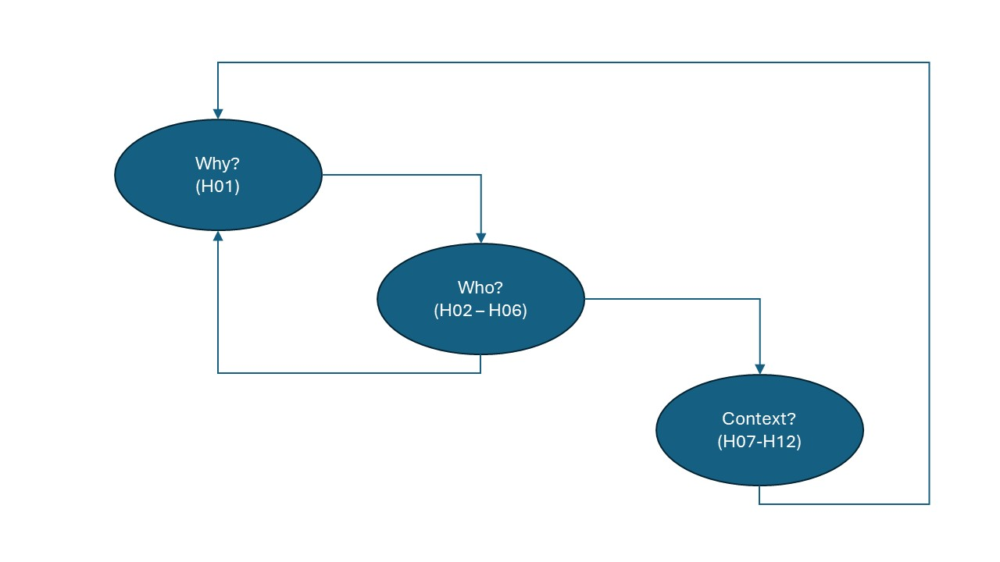

# Generic Route through idea-t and the heuristics
[◄ Go back to ReadMe](../../README.md)

[◄ Go back to About Navigating list](About-Navigating-idea-t.md)
  
This generic Use section shows the flows between heuristics, and what you will find in each heuristic's description. Sections are:
- Flowchart through the heuristics;
- Flowchart focused on the "Who?" Heuristics;
- Flowchart focused on the "Context?" Heuristics;
- Navigating the Heuristic Explanations.

There are other documents in this folder that discuss how to tailor idea-t for different uses and contexts (see [About Navigating idea-t for a list and links](About-Navigating-idea-t.md))

## Generic Use - Flowcharts through the Heuristics

The heuristics group into three themes: Why? Who? and Context?

### Flowchart focused on the "Why?" Heuristic

Why? flowchart

Generally, you would start with answering the question "Why do we need this tool?" then move on to consider the group of "Who?" questions, and finally look at the Context questions. However, information you find out from the "Who?" and "Context?" questions mean you may need to revisit "Why?", because different stakeholders you identify may have different goals in different contexts. You need to iterate between "Why?" and "Who?". The flowchart summarises this.

[Back to Top](#TopofPage)

### Flowchart focused on the "Who?" Heuristics

Who? flowchart

Heuristics H02 to H06 are people-focused questions we found were often not considered and which appeared from our research data to be important factors in understanding testers' characteristics. Add this information to the data you already have about people for whom you are designing the tool. The flowchart summarizes the generic order for addressing this group of heuristics and how they fit with the other heuristic themes with iteration between the themes.

[Back to Top](#TopofPage)

### Flowchart focused on the "Context?" Heuristics

Context? flowchart

Heuristics H07 to H12 cover questions about the contexts within which your stakeholders work. They are aspects to the context that we found affect how people are enabled or blocked in their engagement with and use of tools. Add this information to the data you already have about the contexts within which people work and consider how this affects your design of the tool. The flowchart summarizes the generic order for addressing this group of heuristics and how they fit with the other heuristic themes with iteration between the themes.

[Back to Top](#TopofPage)

### Navigating the Heuristic Explanations

  
 Navigating the Heuristic Explanations

  
Each Heuristic has a page with an overview explanation of the heuristic, the research evidence, and activities. You will find on each heuristics page:

- **Theme:** the heuristics are divided into three themes: *Why* do we need the tool? *Who* will use it? and *Context* the tool will be used in? - **Heuristic question:** just to remind you where you are.
- **Explanation and sub-questions:** provides you with some points to think about, and key questions to ask yourself. Also in this section, a finding from our research that supports this heuristic and a link to some research quotes and characteristics that will help you ground your understanding and decisions.
- **Activities, tools, and techniques to help answer the questions:** A menu of useful techniques, linked to further information either within this repository or on the internet. 

[Back to Top](#TopofPage)

