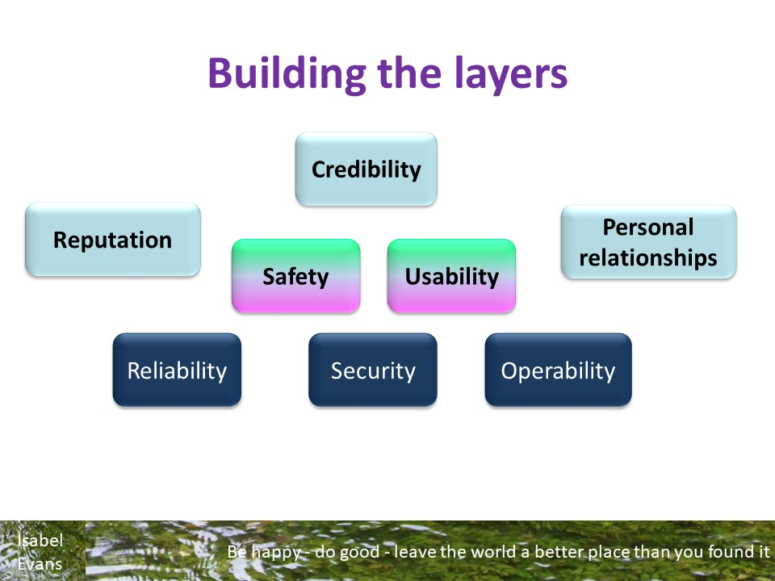

# Building Quality Attribute Pyramids for UX

Quality Attribute Pyramids

Once you have a good understanding of *Who* is going to use the tool and *Why*, and their *Context*, you can start to prioritize the quality attributes and identify which technical attributes contribute to the QiU attributes.

For example, if this tool is to be used in a safety critical domain, to manage and report on critical tests, and will be used by people with a range of experiences and skills, you might focus on:
- health and safety as highest priority;
- effectiveness so that people using the tool are able to see they have taken the action they intended;
- built into enhanced operability but deliberately lowered flexibility of workflows;
- learnability supported by a range of learning materials and a training course;
- supported by high levels of reliability and security.

For example, if this tool is to be used in an organization that values a fast time to market, uses agile processes with high team autonomy, you might focus on:
- efficiency of the people using the tool to work at speed;
- flexibility of the workflows to allow teams to tailor workflows to their own needs;
- learnability supported by the tool interface and with a background of easy to access material;
- supported by performance to aid speed;
- supported by maintainability to support change.

In the simple example below, credibility is built on safety and usability. Safety and Usability and built on reliability, security and operability.  Those quality in use and UX attributes and supported by, and support reputation and perosnal relationships.

     [Back to Top](#TopofPage)
 
## Using Radar Diagrams to Compare Persona Quality Requirements

Radar Diagram Examples

Different personas will have different needs, and different values. The radar diagram shows an example in one project, where the test manager, the automation specialist and a senior stakeholder all had different needs and scored values dofferently when thinking about a particualr tooling requirement. The Test Manager marked trust as a higher concern than the automation specialst, perhaps because the automation specialist understood the tool technically and therefore could trusts its output more. The senior stakeholder was most interested in value for money, while the automation specialist was concerned about flow in their work.

The different values mean that these personas will also rate the quality in use attributes differently for this tool. The automation specialist scored efficiency and extendability most highly; they want to get into a flow in their work. The senior stakeholder may be interested in compliance, legal, and commercial attributes, so scores those more highly. The Test Manager wants certainy in teh reporting and therefore scored effectiveness higher than efficiency. The right balance of these quality in use atributes needs to be found between the personas' requirements.

[Back to Top](#TopofPage)

## Usability, Quality in Use, and the User Experience: how they relate together

Usability, Quality in Use, and the User Experience: how they relate together

Quality in Use (QiU) and Usability had the most frequent mentions in our data. 
Understanding how the different attributes are building blocks to the overall user experience (UX) helps us to design in a better UX, shown in the flowchart below. 
A good User Interface (UI) is supported by interaction design, and contributes to usability, which also includes designing for the users' efficiency, effectiveness, support to meet their goals in their context. 
Usability is one contributor to quality in use, which also includes flexibility in use and freedom from risk. 
QiU is also supported by all the technical attributes, such as maintainability, performance, security. 
QiU contributes to UX, and design should address trust, credibility, flow through tasks and the usefulness of the product. 
All of this, influenced by past experiences, mental models and personal circumstances leads to the lived experience, and gives rise to emotions. 

## Standards and Reference Texts

Standards and References

[Summary of ISO 20510 from TMAP with links to additional attributes](https://www.tmap.net/wiki/quality-characteristics)

[Summary of the ISO/IEC 25000 series of standards](https://iso25000.com/index.php/en/iso-25000-standards)

[ISO 25019 portal](https://www.iso.org/standard/78177.html)

NB: even as I write this, new standards are being developed, published, and discussed meaning there are several ways of dividing up the quality in use and product quality attributes. 
On this page, I have provided a simplified summary of some of the main quality attributes, plus notes from the research data. 
You can of course go to buy the new standard, [ISO 25019](https://www.iso.org/standard/78177.html) which has different definitions.
Or use this summary from TMAP of the previous version ISO 25010 with their additional definitions for AI and sustainability [Summary of ISO 20510 from TMAP with links to additional attributes](https://www.tmap.net/wiki/quality-characteristics). 

